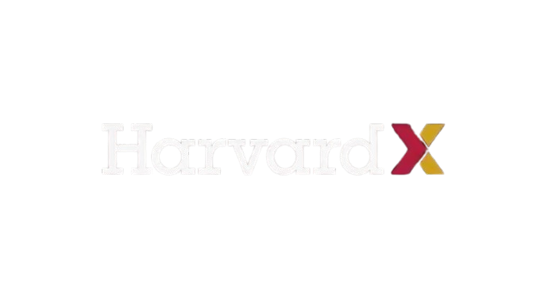

<!-- markdownlint-enable MD033 -->
<div align="center">
  
</div>
<!-- markdownlint-enable MD033 -->

## Overview

This repository contains my solutions for Harvard University's **CS50x: Introduction to Computer Science** (2026 Edition). CS50 is a comprehensive introduction to the intellectual enterprises of computer science and the art of programming.

- **Objective**: Mastering computational thinking and problem-solving.
- **Scope**: From low-level memory management in C to high-level web development with Python and Flask.
- **Progress**: 10/11 Weeks Completed + Final Project.
- **Documentation**: [Technical Specification](docs/specification.txt)

### Repository Structure

```text
CS50x/
├── Week 01 — C                # Fundamentals, Mario, Cash, Credit, Hello
├── Week 02 — Arrays           # Caesar, Readability, Scrabble, Substitution
├── Week 03 — Algorithms       # Plurality, Runoff, Sort, Tideman
├── Week 04 — Memory           # Filter (less/more), Recover, Volume
├── Week 05 — Data Structures  # Inheritance, Speller
├── Week 06 — Python           # DNA, Sentimental projects
├── Week 07 — SQL              # Songs, Movies, Fiftyville
├── Week 08 — HTML, CSS, JS    # Homepage, Trivia
├── Week 09 — Flask            # Finance
├── Week 10 — Final Project    # Web application
└── Assets/                    # Images and resources
```

---

## Complete Course Index

Complete navigation guide with links to all course materials organized by week.

### Week 01 — C Fundamentals

Introduction to C programming language, compilation, and basic logic.

- [hello.c](Week%2001%20—%20C/me/hello.c) - Hello, World!
- [mario.c (less)](Week%2001%20—%20C/mario-less/mario.c) - Mario pyramid (simpler)
- [mario.c (more)](Week%2001%20—%20C/mario-more/mario.c) - Mario pyramid (advanced)
- [cash.c](Week%2001%20—%20C/cash/cash.c) - Cash greedy algorithm
- [credit.c](Week%2001%20—%20C/credit/credit.c) - Credit card validation

### Week 02 — Arrays

Memory, arrays, and string manipulation in C.

- [caesar.c](Week%2002%20—%20Arrays/caesar/caesar.c) - Caesar cipher
- [readability.c](Week%2002%20—%20Arrays/readability/readability.c) - Text readability analyzer
- [scrabble.c](Week%2002%20—%20Arrays/scrabble/scrabble.c) - Scrabble score calculator
- [substitution.c](Week%2002%20—%20Arrays/substitution/substitution.c) - Substitution cipher

### Week 03 — Algorithms

Sorting and searching algorithms, computational complexity analysis.

- [plurality.c](Week%2003%20—%20Algorithms/plurality/plurality.c) - Plurality voting system
- [runoff.c](Week%2003%20—%20Algorithms/runoff/runoff.c) - Runoff voting system
- [tideman.c](Week%2003%20—%20Algorithms/tideman/tideman.c) - Tideman voting system
- [Sort Demo](Week%2003%20—%20Algorithms/sort/) - Sorting algorithm performance tests

### Week 04 — Memory

Pointers, memory allocation (malloc/free), file I/O operations.

#### Filter Program

- [filter-less/filter.c](Week%2004%20—%20Memory/filter-less/filter.c) - Image filtering
- [filter-less/helpers.c](Week%2004%20—%20Memory/filter-less/helpers.c) - Filter implementations
- [filter-more/filter.c](Week%2004%20—%20Memory/filter-more/filter.c) - Advanced filtering
- [filter-more/helpers.c](Week%2004%20—%20Memory/filter-more/helpers.c) - Additional filters

#### Other Projects

- [recover.c](Week%2004%20—%20Memory/recover/recover.c) - JPEG recovery from raw data
- [volume.c](Week%2004%20—%20Memory/volume/volume.c) - Audio volume scaling

### Week 05 — Data Structures

Linked lists, hash tables, tries, and Trees.

- [inheritance.c](Week%2005%20—%20Data%20Structures/inheritance/inheritance.c) - DNA inheritance simulation
- [speller.c](Week%2005%20—%20Data%20Structures/speller/speller.c) - Spell checker with hash tables
- [dictionary.c](Week%2005%20—%20Data%20Structures/speller/dictionary.c) - Dictionary implementation
- [dictionary.h](Week%2005%20—%20Data%20Structures/speller/dictionary.h) - Dictionary header

### Week 06 — Python

Transition to high-level programming with Python.

- [dna.py](Week%2006%20—%20Python/dna/dna.py) - DNA sequence matching
- [cash.py](Week%2006%20—%20Python/sentimental-cash/cash.py) - Cash donation calculator
- [credit.py](Week%2006%20—%20Python/sentimental-credit/credit.py) - Credit card validation
- [hello.py](Week%2006%20—%20Python/sentimental-hello/hello.py) - Hello, World!
- [mario.py (less)](Week%2006%20—%20Python/sentimental-mario-less/mario.py) - Mario pyramid
- [mario.py (more)](Week%2006%20—%20Python/sentimental-mario-more/mario.py) - Mario pyramid advanced
- [readability.py](Week%2006%20—%20Python/sentimental-readability/readability.py) - Readability analyzer

### Week 07 — SQL

Relational databases and SQL queries.

#### Movies Database

- [1.sql](Week%2007%20—%20SQL/movies/1.sql) through [13.sql](Week%2007%20—%20SQL/movies/13.sql) - Movie queries

#### Songs Database

- [1.sql](Week%2007%20—%20SQL/songs/1.sql) through [8.sql](Week%2007%20—%20SQL/songs/8.sql) - Song queries

#### Fiftyville Investigation

- [log.sql](Week%2007%20—%20SQL/fiftyville/log.sql) - Crime scene investigation queries
- [answers.txt](Week%2007%20—%20SQL/fiftyville/answers.txt) - Investigation results

### Week 08 — HTML, CSS, JavaScript

Web frontend development.

#### Homepage

- [index.html](Week%2008%20—%20HTML,%20CSS,%20JavaScript/homepage/index.html) - Home page
- [contact.html](Week%2008%20—%20HTML,%20CSS,%20JavaScript/homepage/contact.html) - Contact page
- [hobbies.html](Week%2008%20—%20HTML,%20CSS,%20JavaScript/homepage/hobbies.html) - Hobbies page
- [projects.html](Week%2008%20—%20HTML,%20CSS,%20JavaScript/homepage/projects.html) - Projects portfolio
- [styles.css](Week%2008%20—%20HTML,%20CSS,%20JavaScript/homepage/styles.css) - Styling
- [main.js](Week%2008%20—%20HTML,%20CSS,%20JavaScript/homepage/main.js) - JavaScript interactions

#### Trivia Quiz

- [index.html](Week%2008%20—%20HTML,%20CSS,%20JavaScript/trivia/index.html) - Quiz game
- [styles.css](Week%2008%20—%20HTML,%20CSS,%20JavaScript/trivia/styles.css) - Quiz styling

### Week 09 — Flask

Full-stack web development with Python Flask.

#### Finance Application

- [app.py](Week%2009%20—%20Flask/finance/app.py) - Main Flask application
- [helpers.py](Week%2009%20—%20Flask/finance/helpers.py) - Helper functions
- [requirements.txt](Week%2009%20—%20Flask/finance/requirements.txt) - Dependencies

#### Templates

- [layout.html](Week%2009%20—%20Flask/finance/templates/layout.html) - Base template
- [index.html](Week%2009%20—%20Flask/finance/templates/index.html) - Portfolio dashboard
- [buy.html](Week%2009%20—%20Flask/finance/templates/buy.html) - Buy stocks form
- [sell.html](Week%2009%20—%20Flask/finance/templates/sell.html) - Sell stocks form
- [quote.html](Week%2009%20—%20Flask/finance/templates/quote.html) - Stock quote search
- [quoted.html](Week%2009%20—%20Flask/finance/templates/quoted.html) - Quote results
- [login.html](Week%2009%20—%20Flask/finance/templates/login.html) - Login form
- [register.html](Week%2009%20—%20Flask/finance/templates/register.html) - Registration form
- [history.html](Week%2009%20—%20Flask/finance/templates/history.html) - Transaction history
- [apology.html](Week%2009%20—%20Flask/finance/templates/apology.html) - Error page
- [add_cash.html](Week%2009%20—%20Flask/finance/templates/add_cash.html) - Add funds

#### Styling

- [styles.css](Week%2009%20—%20Flask/finance/static/styles.css) - Application styling

### Week 10 — Final Project

Capstone project: AI Tools Landscape visualization

- [index.html](Week%2010%20—%20Final%20Project/app/index.html) - Main application
- [app.js](Week%2010%20—%20Final%20Project/app/assets/js/app.js) - Application logic
- [app.css](Week%2010%20—%20Final%20Project/app/assets/css/app.css) - Main styling
- [Icons](Week%2010%20—%20Final%20Project/app/assets/public/icons/) - 40+ AI tool icons
- [Figures](Week%2010%20—%20Final%20Project/app/assets/public/figures/) - Distribution visualizations

---

## Code Metrics

Repository analysis using [cloc](https://github.com/AlDanial/cloc):

| Language | Files | Blank | Comment | Code |
| :--- | ---: | ---: | ---: | ---: |
| CSS | 5 | 276 | 13 | 1,647 |
| C | 22 | 325 | 322 | 1,417 |
| JavaScript | 2 | 176 | 31 | 1,267 |
| HTML | 17 | 113 | 13 | 941 |
| Python | 9 | 139 | 74 | 421 |
| Markdown | 3 | 74 | 2 | 186 |
| C/C++ Header | 5 | 28 | 58 | 92 |
| SQL | 22 | 4 | 14 | 88 |
| make | 3 | 6 | 5 | 19 |
| **TOTAL** | **159** | **97,131** | **532** | **925,238** |

The repository balances low-level system programming (C) with high-level application development (Python/Web).

---

## Technologies Covered

- **Low-level**: C (Pointers, Memory, Structs)
- **High-level**: Python (Dicts, Lists, Objects)
- **Databases**: SQLite, SQL
- **Web Development**: HTML5, CSS3, JavaScript (ES6+), Flask
- **Data Structures**: Linked Lists, Hash Tables, Binary Search Trees, Tries

## Tools & Environment

- **Compiler**: `clang`, `gcc`
- **Build System**: `make`
- **Debugger**: `debug50`, `gdb`, `valgrind`
- **Environment**: VS Code (CS50 Sandbox/Codespaces)
- **Testing**: `check50`, `style50`

## Skills Developed

- **Computational Thinking**: Decomposing complex problems into smaller parts.
- **Algorithm Design**: Sorting, searching, and complexity analysis.
- **Memory Safety**: Manual memory management and leak prevention.
- **Web Architecture**: Client-server model, RESTful APIs.
- **Database Design**: Normalization and efficient querying.

---
<p align="center">
  <i>"This is CS50."</i>
</p>
