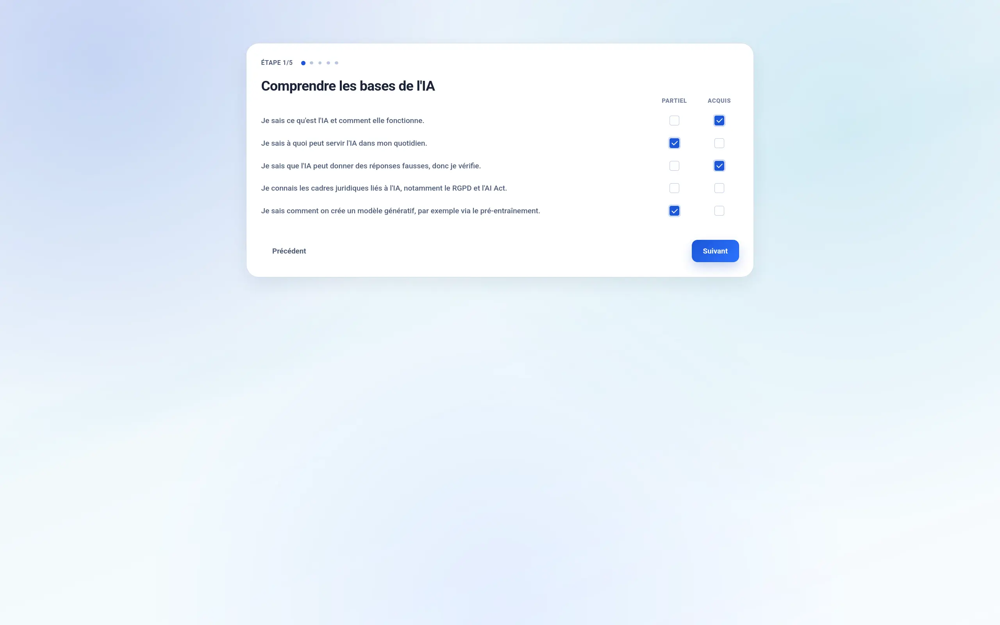
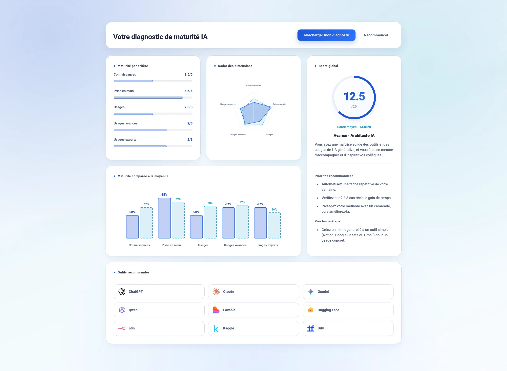
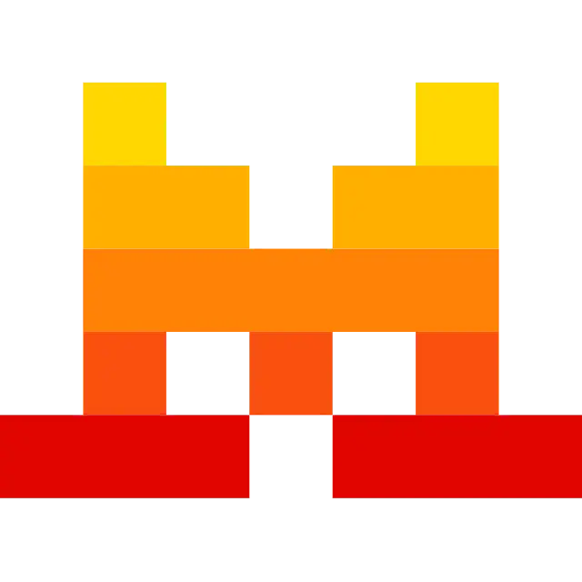
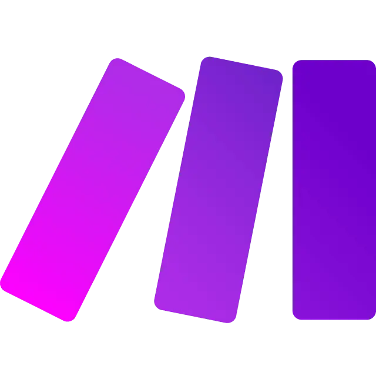

# AI Maturity Scale
#### Video Demo:  <URL HERE>
#### Description:


## Project Overview

The **AI Maturity Scale** is an interactive web-based diagnostic tool designed to assess an individual's knowledge, familiarization, and usage of Artificial Intelligence tools. The goal of this application is to provide a comprehensive and immediate analytical restitution of a user's AI maturity level through a guided questionnaire. 

At the end of the 20-question evaluation, the system classifies the user into one of 5 distinct maturity levels (from Novice to Expert) and dynamically recommends up to 9 relevant AI applications from a curated catalog of 40 tools.


## Structure and Files Description

```txt
.
├── app/
│   ├── index.html
│   └── assets/
│       ├── css/
│       ├── js/
│       └── public/
├── api/
│   ├── stats.py
│   └── submit.py
├── local_server.py
├── vercel.json
├── .gitignore
└── README.md
```

- **`app/index.html`**: Main HTML document that serves the entire Single Page Application (SPA) and loads the Alpine.js frontend framework.
- **`app/assets/js/app.js`**: Core JavaScript logic responsible for handling user interactions, computing state and scores, generating dynamic charts (Radar and Bar charts), and executing the client-side PDF export feature.
- **`app/assets/css/` & `public/`**: Directories containing stylesheets for the responsive UI design, as well as images and media icons used for the tool recommendations.
- **`api/` (Serverless Functions)**: Python scripts (`stats.py` and `submit.py`) deployed on Vercel. They securely communicate with the Supabase database via its native REST API to handle anonymous form submissions and retrieve global averages.
- **`local_server.py`**: A lightweight local HTTP server written in Python, designed to simulate Vercel's routing environment for easy local testing.
- **`vercel.json` & `README.md`**: Project configuration for cloud deployment and the comprehensive documentation you are currently reading.

## Main Features



The questionnaire is based on **20 criteria** (Q01 to Q20), divided into five dimensions: 
- Knowledge
- Familiarization
- Uses
- Advanced Uses
- Expert Uses

Each criterion is evaluated according to three acquisition thresholds (Not acquired, Partial, Acquired) to establish a global score out of 20. This result allows classifying the user according to **5 maturity levels**, from Novice to Expert.

<br>



At the end of the evaluation, the system delivers an immediate analytical restitution with comparative statistics. The profile exposes a radar superimposing performances to the global average, as well as bars measuring the deviation from the norm per criterion. The report can be exported in PDF format (`Diagnostic-maturite-IA.pdf`).

### Distribution of AI Tools by Score

The 40 tools in the catalog are each assigned to a score range `[min, max]`. The recommendation algorithm selects the 9 most relevant tools for the obtained score. 

> **Disclaimer**: *Please note that this catalog and its classification are neither absolute nor exhaustive. The selection of tools and their assignment to specific maturity levels reflect a curated, somewhat arbitrary categorization designed specifically for the scope and educational purpose of this diagnostic.*

The tools are distributed across 5 major maturity levels:

**1. Novice**

This level regroups highly accessible conversational assistants and tools natively integrated into daily office suites. They require absolutely no coding experience and allow users to intuitively generate text, synthesize emails, or create basic visual presentations from simple prompts.
<table><tr>
<td></td>
<td></td>
<td></td>
<td></td>
<td></td>
<td></td>
<td></td>
<td></td>
<td></td>
<td></td>
</tr></table>

**2. Beginner**

This tier introduces foundational automation platforms, open-source models, and low-code web builders. Users at this level can start connecting different applications together using visual flows or build interactive interfaces without needing to write complex algorithms.
<table><tr>
<td></td>
<td></td>
<td></td>
<td></td>
<td></td>
<td></td>
<td></td>
</tr></table>

**3. Intermediate**

Aimed at developers and tech-savvy builders, this category includes powerful web extraction APIs, specialized LLMs offering great logic performance, and collaborative machine learning platforms like Hugging Face or Kaggle. It opens the door to creating personalized workflows and handling data science tasks.
<table><tr>
<td></td>
<td></td>
<td></td>
<td></td>
<td></td>
<td></td>
<td></td>
<td></td>
<td></td>
</tr></table>

**4. Advanced**

These are robust tools designed specifically for software engineering and localized execution. This level encompasses offline inference applications for running local models, sophisticated AI-powered code editors, and orchestration solutions enabling developers to seamlessly integrate LLMs into complex production architectures.
<table><tr>
<td></td>
<td></td>
<td></td>
<td></td>
<td></td>
<td></td>
<td></td>
<td></td>
</tr></table>

**5. Expert**

The final maturity level focuses on entirely autonomous action loops, experimental agentic frameworks, and lifecycle management platforms. These high-end tools allow experts to build and deploy independent AI agents capable of reasoning, utilizing system tools, and resolving deep computational tasks on their own.
<table><tr>
<td></td>
<td></td>
<td></td>
<td></td>
<td></td>
<td></td>
</tr></table>

#### Score Range of Each Tool


#### Density of Available Tools by Score


*(Note: The static charts above visualizing the tool distribution ranges and densities were generated with the assistance of AI).*

## Run Locally

To test this project locally, you will need a Supabase project.

```bash
export SUPABASE_URL="your_supabase_url"
export SUPABASE_KEY="your_supabase_key"
python local_server.py
```

Then open `http://localhost:8080/`.

> **Note**: Data is securely stored on Supabase via its native REST API (zero local dependencies required).

## To-Do

- [ ] **Data export**: Create an automated script for frequent export of Supabase data to CSV (testing and analysis on anonymized results).
- [ ] **Domain name**: Configure Vercel to use the custom domain `https://acculturation-numerique.fr/intelligence-artificielle/diagnostic/`.
- [ ] **Website integration**: Add a Call to Action (CTA) on the `https://acculturation-numerique.fr/intelligence-artificielle/` page to redirect to the diagnostic.
- [ ] **QR Code**: Generate a permanent QR Code pointing to the diagnostic to easily display it in class and at conferences.
