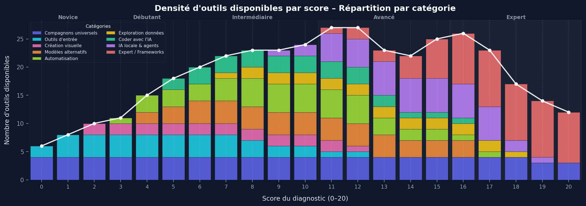

# AI Maturity Scale


## Structure

```txt
.
├── app/
│   ├── index.html                  # Single-page assessment app
│   └── assets/
│       ├── css/
│       │   ├── app.css             # Main styles
│       │   └── pdf.css             # PDF export styles
│       ├── js/
│       │   └── app.js              # Alpine.js logic (questionnaire, scoring, charts, export)
│       └── public/
│           ├── preview.webp        # README screenshot
│           ├── icons/              # Logos for 40 AI tools and the [full catalog](app/assets/public/icons/README.md)
│           └── figures/            # Matplotlib charts (tool ranges and density)
├── .gitignore
└── README.md
```

## Key Features

- Static `HTML/CSS/JS` frontend with `Alpine.js`, no backend dependency.
- **20-criterion** questionnaire (Q01-Q20) split into 5 dimensions:
  - Knowledge · Hands-on · Usage · Advanced Usage · Expert Usage
- Each criterion has 3 states: _Not acquired_ (0 pt) · _Partial_ (0.5 pt) · _Acquired_ (1 pt).
- Global score out of 20 with **5 levels**: Novice -> Beginner -> Intermediate -> Advanced -> Expert.
- Immediate feedback:
  - Personalized level and profile;
  - Radar and trajectory by dimension;
  - **9 recommended AI tools** selected from 40 by score-based centrality;
  - Strengths, improvement areas, and contextual recommendations.
- Browser-side direct PDF export (`AI-Maturity-Diagnostic.pdf`).
- No personal data collection.

## AI Tool Distribution by Score

Each of the 40 catalog tools is assigned a `[min, max]` score range. The recommendation engine selects the 9 most relevant tools for the user's final score. You can review the [full app and tool catalog](app/assets/public/icons/README.md) for detailed links, icons, score ranges, and descriptions.

### Score Range for Each Tool


### Tool Density by Score



## Run Locally

```bash
cd app
python3 -m http.server 8080
```

Then open `http://localhost:8080`.

## WordPress Integration

1. Copy the `<main id="an-diagnostic">…</main>` block from `app/index.html` into a custom HTML block.
2. Load `assets/css/app.css`, `assets/css/pdf.css`, `assets/js/app.js`, Alpine.js, `html2canvas`, and `jsPDF` (CDN) on the page.

## Roadmap

- [ ] Integrate the diagnostic module into the WordPress website.
- [ ] Generate a shareable QR code with tracking for conferences and classes.
